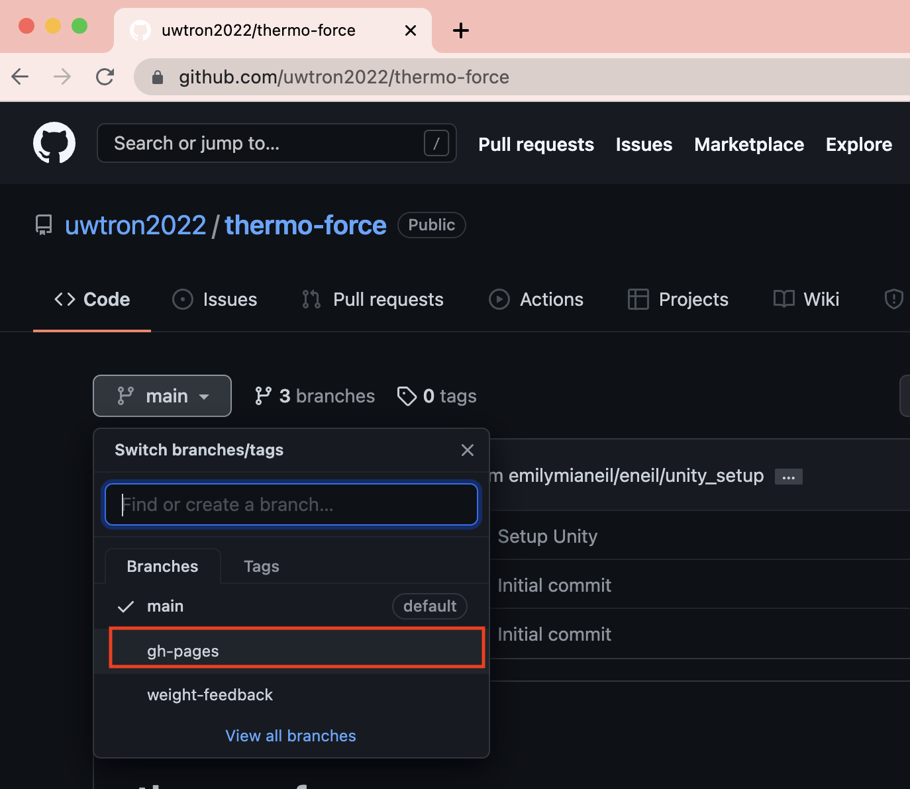
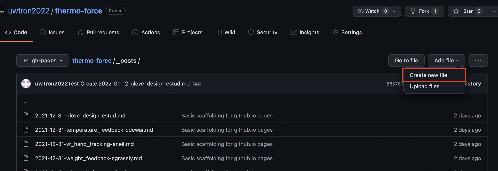
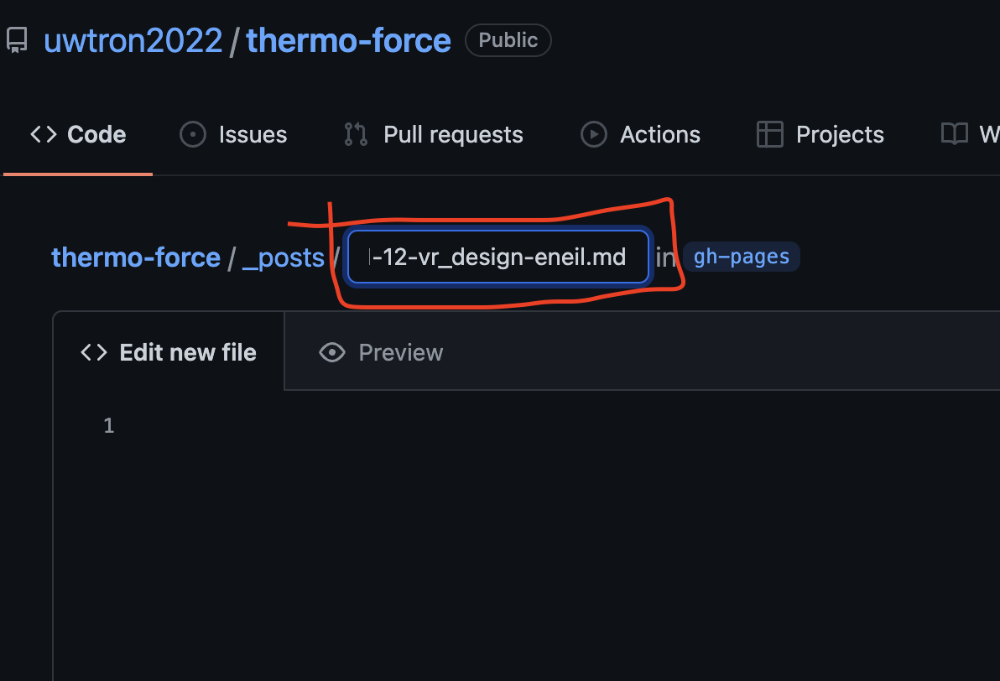
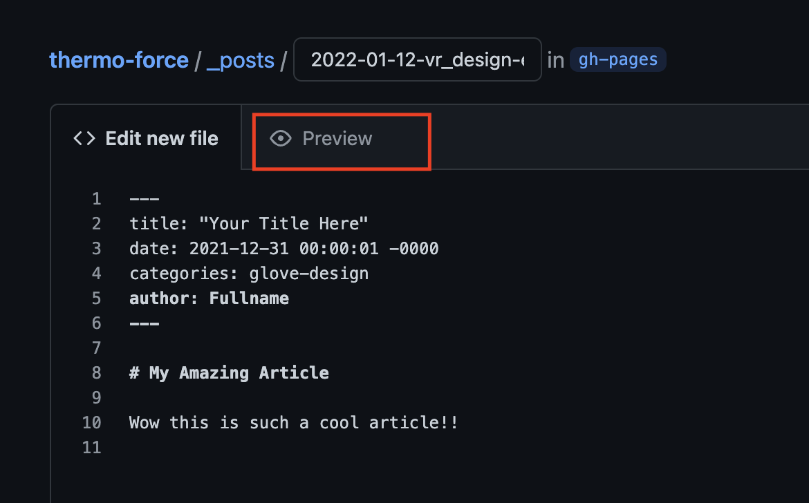
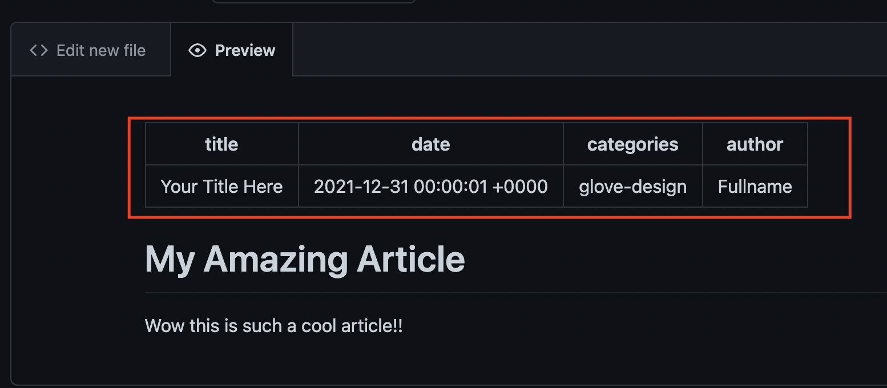
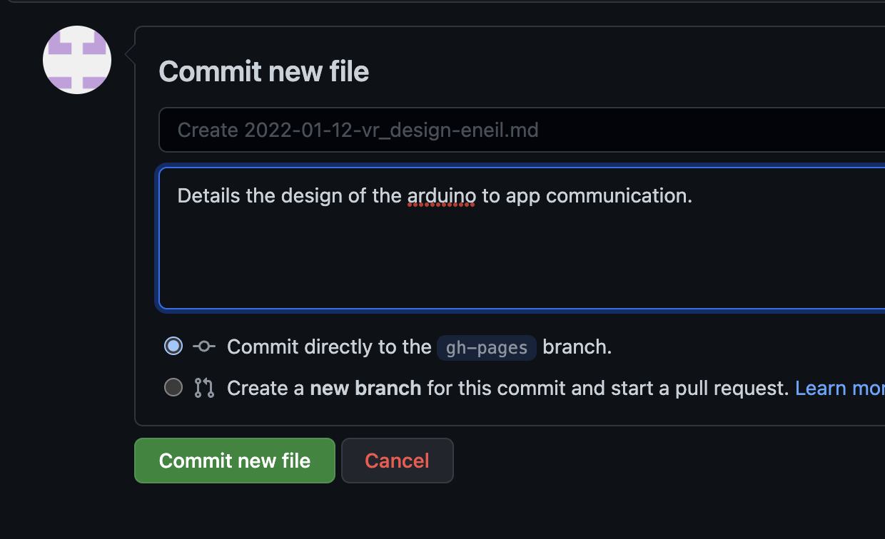
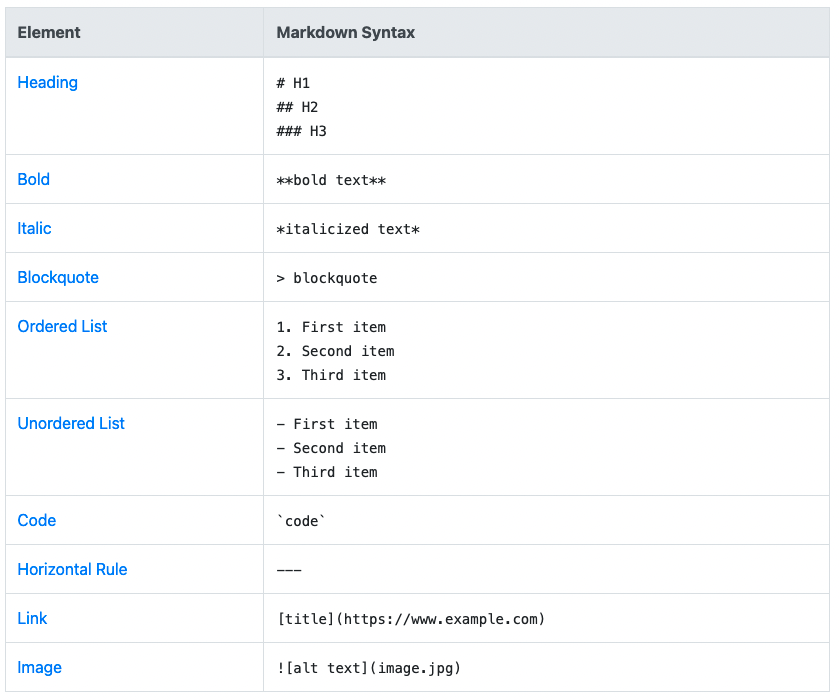

# How to Write a Logbook Entry

Note that it takes a couple minutes to update on our [dev-blog site](https://uwtron2022.github.io/thermo-force/dev-blog/), so just sit tight for a couple min after you're done :)

1. Make sure you are on the ```gh-pages``` branch (good news ... if you're reading this, you're already here!)



***

2. Go to the ```_posts/``` directory [here](https://github.com/uwtron2022/thermo-force/tree/gh-pages/_posts)

***

3. Click ```Add file``` --> ```Create new file```



***

4. Name your file in the format ```YYYY-MM-DD_subsytem_area-userid.md``` as seen below



***

5. Insert a header (at the very beginning of your file) with the following format:

```
--- 
title: "Your Title Here"
date: 2021-12-31 00:00:01 -0000
categories: glove-design
author: Fullname
---
```

Categories and authors must be exact to properly link articles and author profiles, respectively.

- categories can be: ```temperature-feedback```, ```weight-feedback```, ```project-management```, ```vr-hand-tracking``` or ```glove-design```

- authors can be: ```Colin Dewar```, ```Ethan Grasely```, ```Emily Studzinski``` or ```Emily Neil```

***

6. Write your file in Markdown (note that HTML and CSS can be used in Markdown)

***

7. Once you are done, you can preview your changes using the ```Preview``` tab at the top of your file.



Note that your header should appear as a table! 



***

8. Once everything looks good to go, scroll down to the ```Commit new file``` section, and fill everything in appropriately.

- the title of the commit should be left as per the suggestion (dont type anything in(
- the 'optional extended description' should be something short and meaningful
- choose ```Commit directly to the gh-pages branch```
- press ```Commit new file```

These settings should appear as follows:



***


# Using Markdown

Follow this [guide](https://www.markdownguide.org/cheat-sheet/) for a basic understanding of how to use Markdown!

Here are the basics :)



## Inserting Images

This will be the most challenging part of using markdown. You're going to have to make another commit.

It might be helpful to insert photos before you do the logbook entry - so that you can preview your entry with
the images before you commit. 

The process is very similar to before!

1. Upload your image to the ```assets/images``` folder [here](https://github.com/uwtron2022/thermo-force/tree/gh-pages/assets/images) following the same steps,
using ```Add file```-->```Updload files```

***

2. Use the same structure for the commit settings (name your commit ```YYYY-MM-DD_subsytem_area-userid-image1```)

***

3. Once you've committed all the photos you are going to use, then create your logbook submission! 

***

4. Reference your photos using the following syntax:

``````

Now your photos should appear in the preview!

Note that you can commit photos after you create the blogpost, they should won't show up in the preview! 
