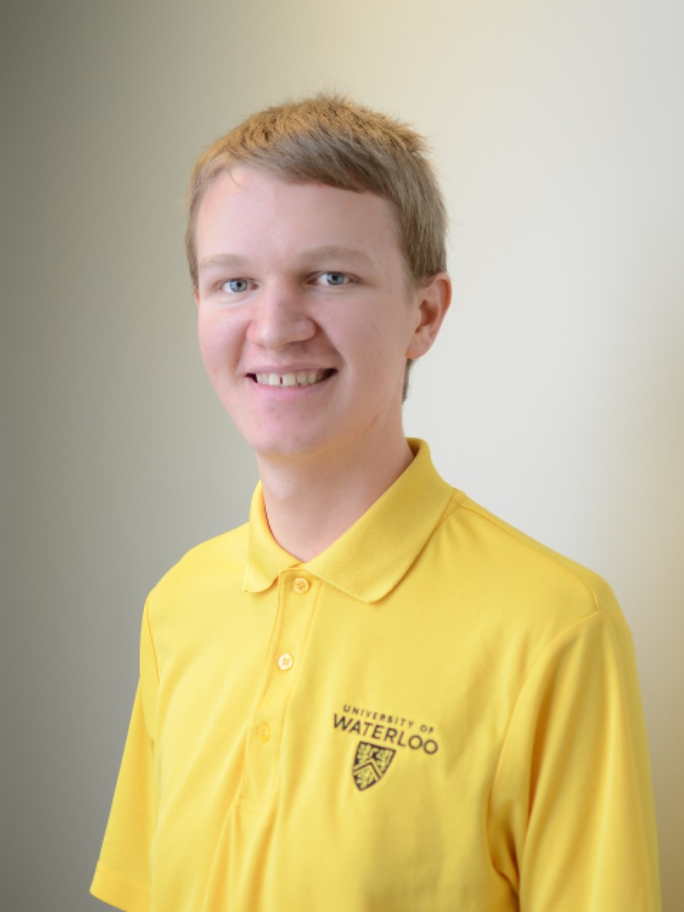
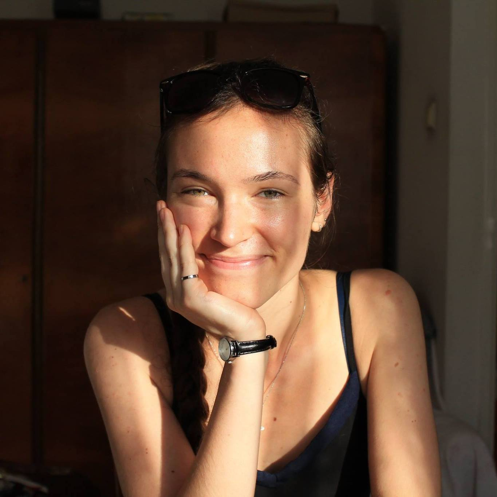
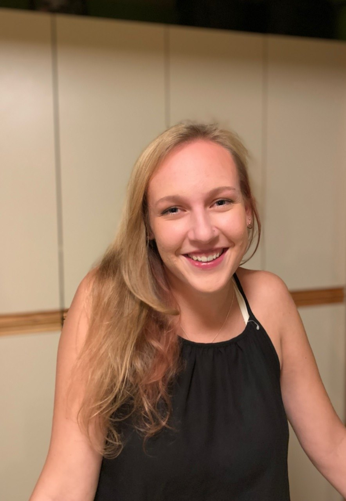

<html>
<head>
<meta name="viewport" content="width=device-width, initial-scale=1">

</head>
<body>

<h2>Meet Our Team :)</h2>
 

  

    

      
      

        <h2>Colin Dewar</h2>
        
Temperature Feedback Lead

        
Hi! I’m Colin and I’m the temperature feedback lead for ThermoForce. I’m a 4B Mechatronics Engineering student at the University of Waterloo.

        
I'm responsible for temperature feedback controller selection, temperature sensor selection, heating element selection, cooling element selection, temperature feedback proof of concept, temperature circuit design, and temperature controls.

        
<button class="button"><a href="mailto:cgdewar@uwaterloo.ca" style="text-decoration:none !important; color:#FFFFFF;text-decoration:none;">Contact</a></button>

      

    

  

  

    

      
      

        <h2>Emily Studzinski</h2>
        
Glove Design Lead

        
Hi! I’m also Emily and I’m the glove design lead for ThermoForce. I’m a 4B Mechatronics Engineering student at the University of Waterloo.

        
I’m responsible for material thermal transfer testing, material selection, material thermal energy transfer simulations, glove design aesthetics, glove design drawings, glove assembly and user testing for glove sub-system.

        
<button class="button"><a href="mailto:estudzinski@uwaterloo.ca" style="text-decoration:none !important; color:#FFFFFF;text-decoration:none;">Contact</a></button>

      

    

  

  

    

      
      

        <h2>Ethan Grasely</h2>
        
PM & Weight Feedback Lead

         
Hi! I’m Ethan and I’m the project manager and weight feedback lead for ThermoForce. I’m a 4B Mechatronics Engineering student at the University of Waterloo.

        
I’m responsible for the project timeline, scheduling and leading meetings, logbook submissions, timekeeping, presentation planning, deliverable planning and outlining, and budgeting. As weight feedback team lead, I’m responsible for overall architecture of weight feedback system, meaning parts selection and verification, circuit building, controls loop design and implementation, and design/fabrication of the electronics mounting mechanism.

        
<button class="button"><a href="mailto:emgrasley@uwaterloo.ca" style="text-decoration:none !important; color:#FFFFFF;text-decoration:none;">Contact</a></button>

      

    

  

  

    

      
      

        <h2>Emily Neil</h2>
        
Software Lead

         
Hi! I’m Emily and I’m the software lead for ThermoForce. I’m a 4B Mechatronics Engineering student at the University of Waterloo.

        
I’m responsible for website architecture and maintenance, VR development platform design, hand tracking to application to controller architecture design, anti-gravity check design and proof of concept for hand tracking.

        
<button class="button"><a href="mailto:eneil@uwaterloo.ca" style="text-decoration:none !important; color:#FFFFFF;text-decoration:none;">Contact</a></button>

      

    

  

</body>
</html>
